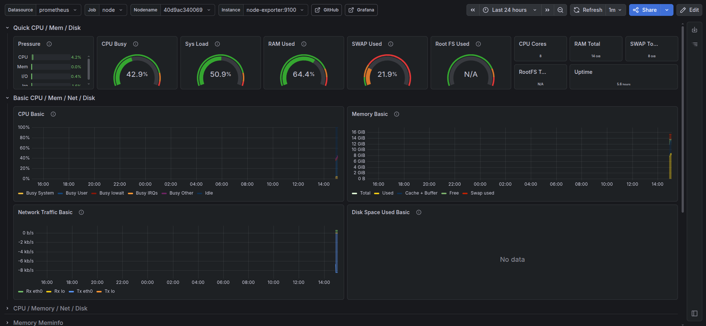

# Minecraft Modpack Server — Docker

[](https://hub.docker.com/r/jstn9/minecraft-server)

Containerized Minecraft modpack server with CI/CD and monitoring.

## Requirements

- Docker 20.10+
- Docker Compose 2.0+
- 4GB+ RAM

## Quick Start

```bash
git clone https://github.com/jstin9/minecraft-server-docker.git
cd minecraft-server-docker
docker compose up -d
```

Server starts at `localhost:25565`. First launch downloads the modpack automatically.

## Configuration

Key environment variables:

| Variable | Default | Description |
|---|---|---|
| `MEMORY` | `4G` | Java heap size |
| `MODRINTH_MODPACK` | `fabulously-optimized` | Modpack slug from modrinth.com |
| `MODRINTH_VERSION` | latest stable | Specific modpack version |
| `MODRINTH_PROJECTS` | — | Extra mods (`slug` or `slug:version`) |
| `MODRINTH_EXCLUDE_FILES` | — | Mods to exclude |

## Ports

| Port | Protocol | Description |
|---|---|---|
| `25565` | TCP | Minecraft |
| `24454` | UDP | Simple Voice Chat |
| `9090` | TCP | Prometheus |
| `3000` | TCP | Grafana |

## Monitoring

Prometheus and Grafana are included in the stack.

Open Grafana at `http://localhost:3000` (admin / admin), add Prometheus as a data source (`http://prometheus:9090`), and import dashboard ID `1860` for CPU, RAM, disk, and network metrics.



## Data Persistence

World data is stored in a Docker volume and survives container restarts. To wipe everything and start fresh:

```bash
docker compose down -v
```

To create a backup of your world into your home directory, run `backup.sh`. It stops the Minecraft container, archives the world data, and saves the backup in `~/mc-backups` before starting the server again.

## CI/CD

GitHub Actions runs on every push to `main`:
- validates `docker-compose.yml`
- lints `Dockerfile` via hadolint
- builds and pushes the image to Docker Hub

## Based On

- [itzg/minecraft-server](https://github.com/itzg/docker-minecraft-server)
- [Fabulously Optimized](https://modrinth.com/modpack/fabulously-optimized)